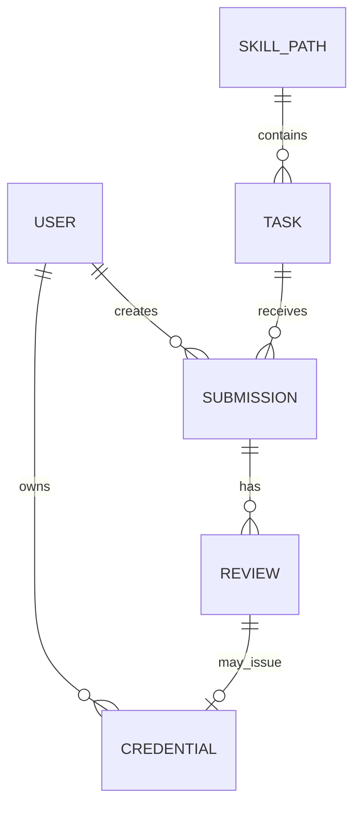

# Maxx Engage Technical Spec

## Status

Phase 0/1 technical baseline for Maxx Engage, the Competence Engine of Civilization OS.
This document defines the current MVP architecture, data contracts, trust model,
and verification loop. It should be updated whenever scoring, identity,
credentials, or user-facing review behavior changes.

## Mission Boundary

Maxx Engage verifies competence through real tasks, transparent rubrics, calibrated AI
review, human escalation, and user-owned credentials.

The MVP focuses on one wedge: frontend web development for global digital talent,
with African and low-bandwidth users treated as first-class users from day one.

Out of scope for the MVP:

- Truth Engine
- Decision Engine
- Tokens or payment mechanics
- Full DAO governance
- Mobile apps
- Full multi-agent orchestration

## System Architecture

```text
+-------------------------------------------------------------+
| Frontend: Next.js, TypeScript, Tailwind, shadcn/ui           |
| - assessment flow                                            |
| - dashboard and submissions                                  |
| - public profile and credential pages                        |
| - identity and wallet surfaces                               |
+-------------------------------------------------------------+
| Backend: Python, FastAPI                                     |
| - auth and user routes                                       |
| - skill paths and task APIs                                  |
| - assessment and submission review                           |
| - credential issuance and visibility                         |
| - identity, DID, Sybil resistance, Passport integration      |
+-------------------------------------------------------------+
| Services                                                     |
| - grading and rubric scoring                                 |
| - skill decay and consistency checks                         |
| - VC signing and DID key support                             |
| - ZK-ready proof abstractions                                |
| - calibration runner                                         |
+-------------------------------------------------------------+
| Data: Supabase Postgres                                      |
| - users, skill paths, tasks, submissions, reviews             |
| - credentials and credential visibility                      |
| - DID keys and identity stamps                               |
| - calibration log                                            |
+-------------------------------------------------------------+
```

## Repository Layout

```text
backend/
  app/
    api/routes/          FastAPI route modules
    core/                config, database, logging
    models/              request/response models
    services/            domain services
  requirements.txt

frontend/
  src/app/               Next.js App Router pages
  src/components/        shared UI
  src/lib/               API and auth helpers

schemas/                 JSON Schemas for public contracts
rubrics/                 transparent scoring rubrics
evals/                   calibration datasets and runner
supabase/migrations/     database schema and policy changes
docs/                    operating and architecture docs
```

## Public Data Contracts

The source of truth for domain contracts is the `schemas/` directory:

- `schemas/user.json`
- `schemas/skill_path.json`
- `schemas/task.json`
- `schemas/submission.json`
- `schemas/review.json`
- `schemas/credential.json`

Any API response that exposes these entities should remain compatible with the
matching schema unless a migration note is added here.

## Core Domain Model



## Assessment Flow

1. User signs in and chooses a skill path.
2. Backend returns suitable tasks for the user's level.
3. User submits work.
4. AI review scores the submission against a public rubric.
5. Low-confidence, borderline, or high-value reviews enter human review.
6. If eligible, the backend issues a credential.
7. User controls whether the credential is public.
8. Appeals remain available for AI judgments that affect outcomes.

## Scoring Requirements

Every AI review must include:

- rubric ID
- model version
- prompt hash when available
- dimension-level scores
- plain-English rationale
- confidence score
- user-visible feedback
- credential eligibility

No score that affects opportunity may be hidden from the user.

## Calibration Loop

Calibration is preserved through JSONL eval files and the database
`calibration_log` table.

Per-case metrics:

- absolute error against human score when available
- in-range evaluation against expected score bands
- pass/fail agreement
- bias, where positive means AI is more generous than the human grader

Aggregate metrics:

- mean absolute error
- within-5 score rate
- pass agreement rate
- in-range rate

The first calibration target is `evals/web-dev-html-001.jsonl`.

## Identity and Sybil Resistance

Maxx Engage starts with pragmatic identity signals and keeps the path open to
self-sovereign credentials:

- Gitcoin/Human Passport score via `GITCOIN_SCORER_ID`
- DID key support for issuer and user identity
- identity stamps stored separately from raw submissions
- trust-network vouching as a future additive signal

No single proof-of-personhood provider should become mandatory infrastructure.

## Credentials

Credentials should be W3C Verifiable Credential compatible and user-owned.

Minimum credential claims:

- subject DID or user identifier
- skill path
- level
- rubric ID
- score band or achievement level
- issue timestamp
- expiry or decay metadata
- issuer DID
- review provenance

Public proof pages must respect user visibility choices.

## Security and Privacy Rules

- Service-role database access is backend-only.
- User-facing APIs must enforce ownership and visibility checks.
- Admin-only tables, including calibration logs, should use RLS and service-role access.
- Secrets must not be committed.
- Raw personal data should not be required when aggregate or derived signals are enough.
- Appeals and audit trails must preserve the decision path.

## Deployment Baseline

- Frontend: Vercel-compatible Next.js app
- Backend: FastAPI process using `uvicorn`
- Database: Supabase Postgres
- Migrations: `supabase/migrations/*.sql`

## Open Technical Decisions

1. First production-grade VC issuer implementation.
2. Final human review queue workflow and reviewer permissions.
3. Appeal SLA and reviewer assignment policy.
4. Long-term model plurality strategy after the first scoring endpoint works.
5. Whether to add a specialized vector store or keep Postgres-only for the MVP.

## References

- W3C Verifiable Credentials Data Model: https://www.w3.org/TR/vc-data-model-2.0/
- W3C Decentralized Identifiers: https://www.w3.org/TR/did-core/
- NIST AI Risk Management Framework: https://www.nist.gov/itl/ai-risk-management-framework
- OWASP Top 10 for LLM Applications: https://owasp.org/www-project-top-10-for-large-language-model-applications/
- Human Passport docs: https://docs.passport.xyz/
